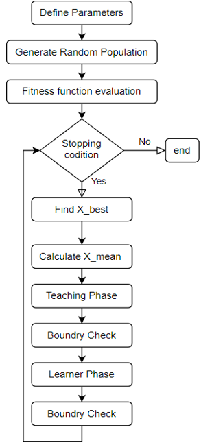

# TLBO Algorithm Notes

## Flowchart
<p align="center">
  
</p>

## TLBO Overview
- **Teacher Phase**: 
  - Generates new solutions using the best solution and the population mean.
  - Uses the modification rule:
    ```
    X_new = X_old + r_i × (X_teacher - T_f × X_mean)
    ```
    where:
    - `T_f` is the teaching factor (1 or 2).
    - `r_i` is a random number.
    - `X_teacher` is the best solution in the population.
    - `X_mean` is the mean of the population.

- **Learner Phase**:
  - Creates new solutions using a partner solution.
  - Modification rules:
    - If `f(X) < f(X_p)`: 
      ```
      X_new = X + r_i × (X - X_p)
      ```
    - If `f(X) ≥ f(X_p)`:
      ```
      X_new = X - r_i × (X_p - X)
      ```
    where:
    - `X_p` is a randomly selected partner solution.
    - `r_i` is a random number.
    - `f(X)` represents the objective function value of `X`.

## Notes
- Ensure random number generators are properly initialized to maintain consistency in results.
- Tune the teaching factor and other parameters based on the specific optimization problem.

## Troubleshooting
- Verify the correct implementation of the teacher and learner phases.
- Check for correct calculation of the population mean and best solution.
- Ensure that the greedy selection is properly performed to accept better solutions.

## References
- Refer to research papers and literature on TLBO for more in-depth understanding and variations of the algorithm.
